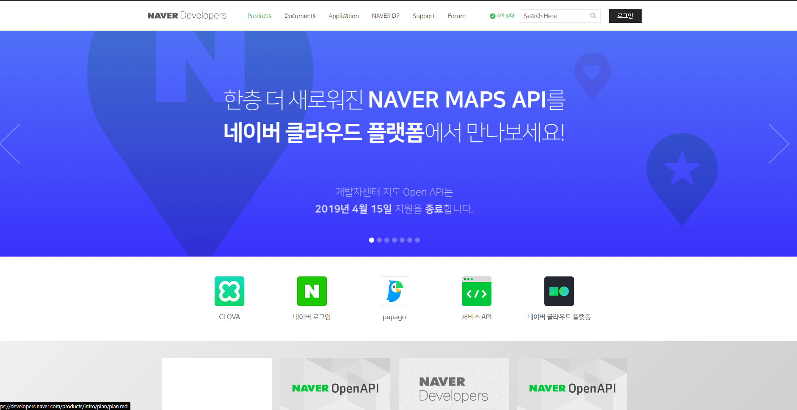
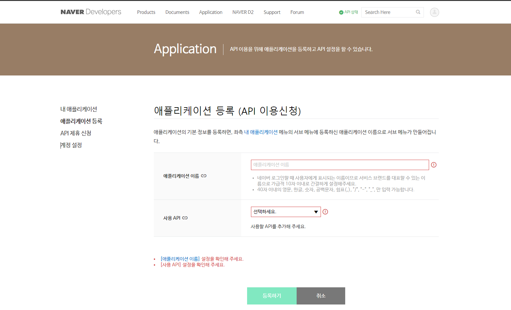
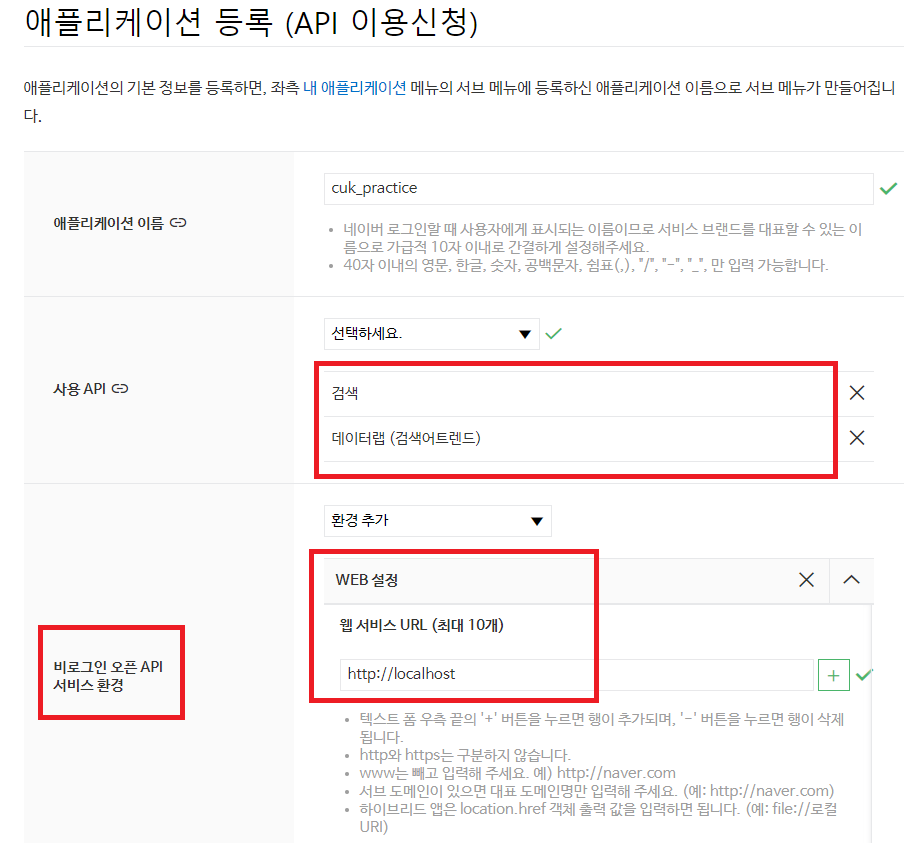
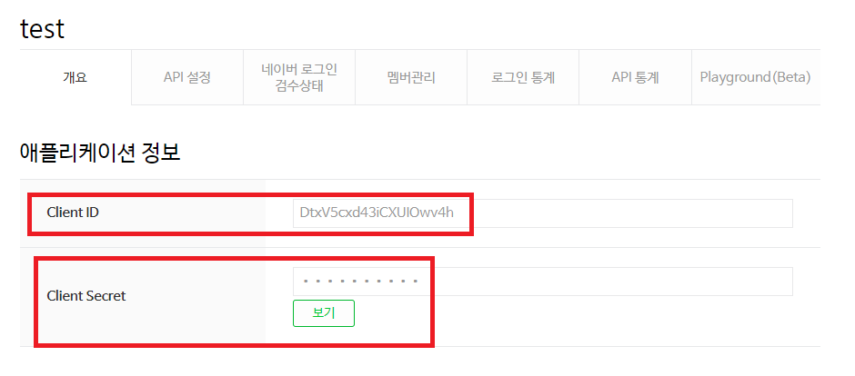
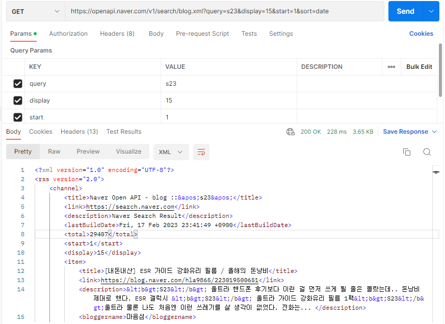
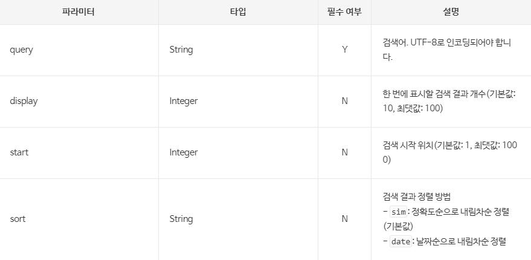

# 네이버 API를 활용한 데이터 수집하기


## Naver Developers 가입

- naver API 사용을 위해  [네이버 개발자 센터](https://developers.naver.com) 로 들어간다.



- 네이버에 로그인 후 Application 메뉴로 들어간다.




- Application 등록을 하여 API 이용신청을 한다.



- 내 애플리케이션에 등록된 `Client ID` 및 `Client Secret` 을 획득한다.



# api 테스트

- curl 방식

```
curl -k  "https://openapi.naver.com/v1/search/blog.xml?query=s23&display=10&start=1&sort=sim" -H "X-Naver-Client-Id: {clientID}" -H "X-Naver-Client-Secret: {secret}}" -v
```

- api test tool 이용 (postman 사용)
  * test tool 사용을 위해 [Postman](https://www.postman.com/downloads/) 로 들어간다.
  * Postman으로 api를 테스트한다.




# 블로그 데이터 수집

- 블로그 api 활용하기
 * 블로그 api를 활용하기 위해 서비스 제공자의 가이드 문서를 활용한다.  [블로그 api documents](https://developers.naver.com/docs/serviceapi/search/blog/blog.md#%EB%B8%94%EB%A1%9C%EA%B7%B8) 로 들어간다.

 * api 파라미터 확인
 
 

 * 예제 코드 확인 및 실행

```
# 네이버 검색 API 예제 - 블로그 검색
import os
import sys
import urllib.request
client_id = "YOUR_CLIENT_ID"
client_secret = "YOUR_CLIENT_SECRET"
encText = urllib.parse.quote("검색할 단어") # 아스키 코드를 URL로 변경
url = "https://openapi.naver.com/v1/search/blog?query=" + encText # JSON 결과
# url = "https://openapi.naver.com/v1/search/blog.xml?query=" + encText # XML 결과
request = urllib.request.Request(url)
request.add_header("X-Naver-Client-Id",client_id)
request.add_header("X-Naver-Client-Secret",client_secret)
response = urllib.request.urlopen(request)
rescode = response.getcode()
if(rescode==200):
    response_body = response.read()
    print(response_body.decode('utf-8'))
else:
    print("Error Code:" + rescode)
```

* 예제 코드와 api 테스트 툴을 비교한 api 활용
  + parameter 추가

```
import os
import sys
import urllib.request
client_id = "DtxV5cxd43iCXUIOwv4h"
client_secret = "ErBqsqeU1V"
encText = urllib.parse.quote("서울 갈비 맛집")  # 아스키 코드를 URL로 변경
display = '&display=15'
sort = '&sort=date'
url = "https://openapi.naver.com/v1/search/blog?query=" + encText + display+ sort# JSON 결과
# url = "https://openapi.naver.com/v1/search/blog.xml?query=" + encText # XML 결과
request = urllib.request.Request(url)
request.add_header("X-Naver-Client-Id",client_id)
request.add_header("X-Naver-Client-Secret",client_secret)
response = urllib.request.urlopen(request)
rescode = response.getcode()
if(rescode==200):
    response_body = response.read()
    print(response_body.decode('utf-8'))
else:
    print("Error Code:" + rescode)
```


 * Json 구조를 명확히 파악하기 위해 response 결과를 [json parser](http://json.parser.online.fr/) 를 통해 확인한다.

* Json encoding을 Python Object로 변경 (Json decoding)
  + Json encoding 시 최상위 Object는 Dictionary임


```
import os
import sys
import urllib.request
import json     #json import
import pandas as pd

client_id = "DtxV5cxd43iCXUIOwv4h"
client_secret = "ErBqsqeU1V"
encText = urllib.parse.quote("서울 갈비 맛집")  # 아스키 코드를 URL로 변경
display = '&display=15'
sort = '&sort=date'
url = "https://openapi.naver.com/v1/search/blog?query=" + encText + display+ sort# JSON 결과
# url = "https://openapi.naver.com/v1/search/blog.xml?query=" + encText # XML 결과
request = urllib.request.Request(url)
request.add_header("X-Naver-Client-Id",client_id)
request.add_header("X-Naver-Client-Secret",client_secret)
response = urllib.request.urlopen(request)
rescode = response.getcode()
if(rescode==200):
    response_body = response.read()
    # print(response_body.decode('utf-8'))
    result = json.loads(response_body)   # json 라이브러리를 활용한 파이썬 Dictionary로 변경
    # for i in result['items']:
    #     print(i['postdate'],i['title'],i['description'],i['link'])
        
    df = pd.DataFrame(result['items'])    
    print(df)
    # result = pd.DataFrame(result)
else:
    print("Error Code:" + rescode)
```

* 특정 컬럼만 추출하기 및 tabulate 로 데이터 정리하기
  + pip install tabulate

```
import os
import sys
import urllib.request
import json     #json import
import pandas as pd
from tabulate import tabulate

client_id = "DtxV5cxd43iCXUIOwv4h"
client_secret = "ErBqsqeU1V"
encText = urllib.parse.quote("서울 갈비 맛집")  # 아스키 코드를 URL로 변경
display = '&display=15'
sort = '&sort=date'
url = "https://openapi.naver.com/v1/search/blog?query=" + encText + display+ sort# JSON 결과
# url = "https://openapi.naver.com/v1/search/blog.xml?query=" + encText # XML 결과
request = urllib.request.Request(url)
request.add_header("X-Naver-Client-Id",client_id)
request.add_header("X-Naver-Client-Secret",client_secret)
response = urllib.request.urlopen(request)
rescode = response.getcode()
if(rescode==200):
    response_body = response.read()
    # print(response_body.decode('utf-8'))
    result = json.loads(response_body)   # json 라이브러리를 활용한 파이썬 Dictionary로 변경
    # for i in result['items']:
    #     print(i['postdate'],i['title'],i['description'],i['link'])
        
    df = pd.DataFrame(result['items'])
    df = df.drop(['bloggername','bloggerlink'], axis=1)  
    print(tabulate(df, headers ='keys',tablefmt ='psql'))
    # result = pd.DataFrame(result)
else:
    print("Error Code:" + rescode)
```


* csv로 내보내기

```
import os
import sys
import urllib.request
import json     #json import
import pandas as pd
from tabulate import tabulate

client_id = "DtxV5cxd43iCXUIOwv4h"
client_secret = "ErBqsqeU1V"
encText = urllib.parse.quote("서울 갈비 맛집")  # 아스키 코드를 URL로 변경
display = '&display=15'
sort = '&sort=date'
url = "https://openapi.naver.com/v1/search/blog?query=" + encText + display+ sort# JSON 결과
# url = "https://openapi.naver.com/v1/search/blog.xml?query=" + encText # XML 결과
request = urllib.request.Request(url)
request.add_header("X-Naver-Client-Id",client_id)
request.add_header("X-Naver-Client-Secret",client_secret)
response = urllib.request.urlopen(request)
rescode = response.getcode()
if(rescode==200):
    response_body = response.read()
    # print(response_body.decode('utf-8'))
    result = json.loads(response_body)   # json 라이브러리를 활용한 파이썬 Dictionary로 변경
    # for i in result['items']:
    #     print(i['postdate'],i['title'],i['description'],i['link'])
        
    df = pd.DataFrame(result['items'])
    df = df.drop(['bloggername','bloggerlink'], axis=1)  
    # print(tabulate(df, headers ='keys',tablefmt ='psql'))
    # result = pd.DataFrame(result)
    df.to_csv("blog_data.csv", index=False, encoding="utf-8-sig")  # 한글 깨짐 방지를 위해 인코딩 명시
else:
    print("Error Code:" + rescode)
```


